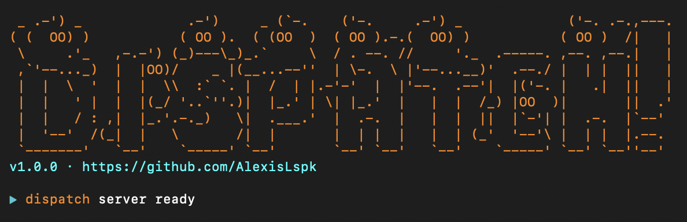

## What it is

Multi-agent MCP orchestrator for Cursor, Claude Code, or any MCP-compatible client. Describe a code review or audit task in plain English, Dispatch plans a DAG, runs specialist agents in parallel, critiques results, and returns one prioritized report.

---

## How it works

```
You: "review this auth middleware for production readiness"

Dispatch:  plan → run agents (DAG) → critique → merge → report
```

Agents run in stages. Those with no dependencies run first; downstream agents get prior results as context.

---

## Demo

```bash
npx dispatch-mcp
```

<pre>
<span style="color: #22d3ee">▶</span> <span style="color: #e67e22">dispatch</span>  <span style="color: #a855f7">planning...</span>
<span style="color: #22d3ee">▶</span> <span style="color: #e67e22">dispatch</span>  routing to <span style="color: #22d3ee">[security] [architecture]</span>
<span style="color: #22d3ee">▶</span> <span style="color: #e67e22">dispatch</span>  <span style="color: #22d3ee">[security]</span> done <span style="color: #22c55e">3.1s</span>
<span style="color: #22d3ee">▶</span> <span style="color: #e67e22">dispatch</span>  <span style="color: #22d3ee">[architecture]</span> done <span style="color: #22c55e">3.4s</span>
<span style="color: #22d3ee">▶</span> <span style="color: #e67e22">dispatch</span>  routing to <span style="color: #22d3ee">[testing]</span>
<span style="color: #22d3ee">▶</span> <span style="color: #e67e22">dispatch</span>  <span style="color: #22d3ee">[testing]</span> done <span style="color: #22c55e">2.0s</span>
<span style="color: #22d3ee">▶</span> <span style="color: #e67e22">dispatch</span>  <span style="color: #a855f7">critiquing...</span>
<span style="color: #22d3ee">▶</span> <span style="color: #e67e22">dispatch</span>  <span style="color: #a855f7">merging...</span>
<span style="color: #22c55e">✔</span> <span style="color: #e67e22">dispatch</span>  done in <span style="color: #22c55e">8.5s</span> — <span style="color: #22c55e">3 agents, 2 stages, 0 failures</span>
</pre>

---

## Install

```bash
npx dispatch-mcp
```

---

## Config

Add to `.cursor/mcp.json` (project root or `~/.cursor/mcp.json`):

```json
{
  "mcpServers": {
    "dispatch": {
      "command": "npx",
      "args": ["-y", "dispatch-mcp"],
      "env": {
        "ANTHROPIC_API_KEY": "your-api-key-here"
      }
    }
  }
}
```

Restart Cursor. Three tools: `dispatch_run`, `dispatch_plan`, `dispatch_agent`.

---

## Adding agents

Open `src/agents/registry.ts` and add an entry. The Planner discovers it automatically.

```typescript
makeAgent(
  "i18n",
  "Finds hardcoded strings that should be externalized for internationalization.",
  `You are an i18n specialist. Find hardcoded user-facing strings that should be 
moved to translation files. Format as a numbered list with file locations.`
),
```

---

## Agents (9 built-in)

| Agent | Focus |
|-------|-------|
| security | Injection, auth, OWASP Top 10 |
| performance | N+1, memory leaks, caching |
| architecture | SOLID, coupling, design patterns |
| testing | Coverage gaps, flaky tests |
| documentation | Docstrings, naming, APIs |
| accessibility | ARIA, WCAG 2.1 AA |
| dependencies | CVEs, outdated, licenses |
| i18n | Hardcoded strings, locale, RTL |
| devops | CI/CD, Docker, secrets, observability |

---

## More

- **Env:** `ANTHROPIC_API_KEY` required. Optional: `DISPATCH_CACHE_DIR`, `DISPATCH_DISABLE_CACHE=1`
- **Local dev:** `.env` with key, then `npm run dev`
- **Examples:** `examples/` — sample inputs for each tool

MIT · [GitHub](https://github.com/AlexisLspk/dispatch-mcp)
